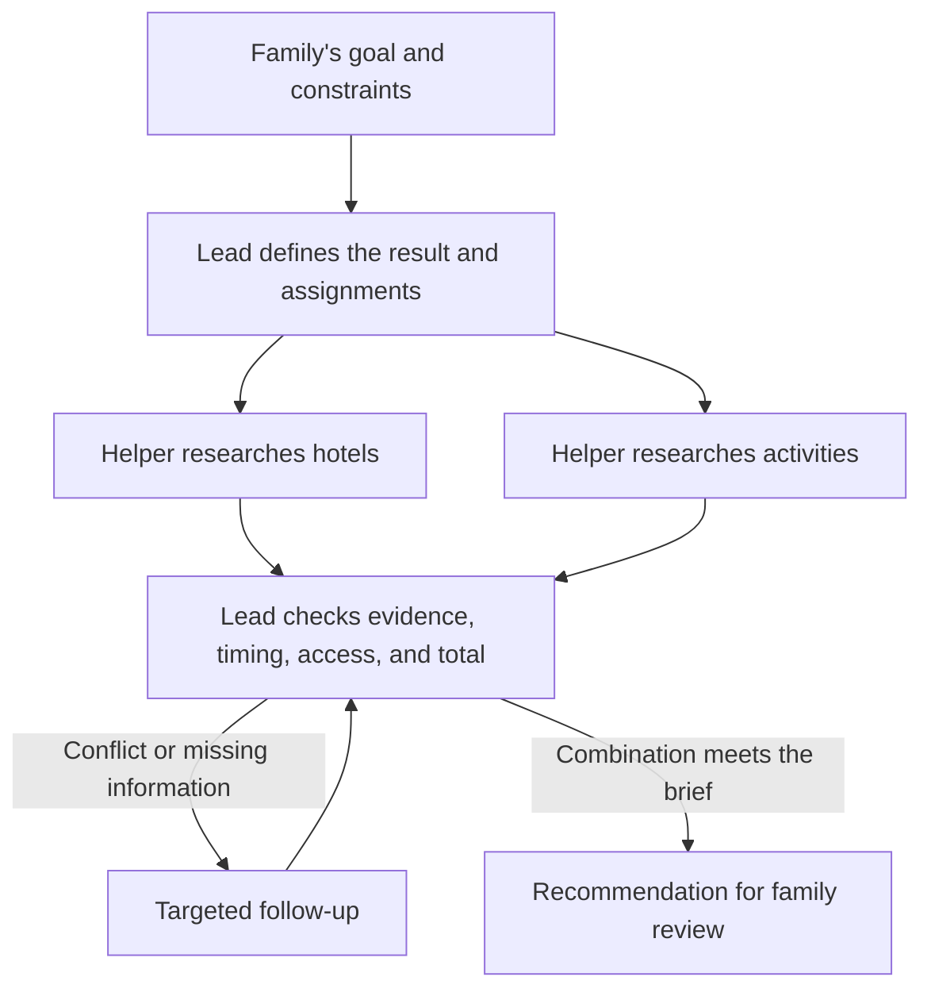

# Explaining agents, subagents, and orchestration

**Recommendation.** Start by saying that one agent can often do the entire job. Then extend the familiar travel example until there is a useful reason to delegate. Show the assignment, the returned findings, and a conflict the lead agent must resolve. The learner should finish able to propose a division of work and explain why it helps.

This is a teaching proposal for a beginner who already knows the four labels: agent, skill, connector, and subagent. The examples and dialogue are fictional. The presentation recommendations are editorial judgments informed by the sources below; they have not been tested with the intended reader.

## The gap in the current explanation

The current guide explains what a subagent is, but its flight example introduces helpers before establishing why they are useful. “One conversation. A whole team.” can make a team sound necessary. Searching dates and then comparing the returned fares also illustrates a dependency rather than two independent investigations.

The missing bridge is from knowing the vocabulary to designing the work. A beginner needs to see a complete assignment, what can proceed independently, and what only makes sense after the findings return. A hierarchy diagram alone cannot teach that.

Three specific changes would address this:

1. Make the existing flight comparison a one-agent example, with skills optional and actual data access explicit.
2. Follow it with a larger trip investigation that has bounded, independent questions.
3. Finish with an incompatibility between otherwise reasonable findings, then show the lead resolving it.

## A talk-through script

**“Why can’t one agent do everything?”**

It often can. Imagine asking one assistant to compare two flights you have already found. It can read both, compare the baggage rules, and explain the tradeoff. Giving that small job to several helpers could create more work than it saves.

Now imagine comparing several possible destinations for a family trip. Each destination needs research into travel, accommodation, and family requirements. There may be a useful division: one helper investigates Lisbon, another investigates Porto. The lead keeps the family’s overall priorities and compares the finished reports.

The practical question is whether a piece can be handed over with a clear brief and come back as something useful. Start with one agent; add a helper when that handoff has a clear benefit. Anthropic recommends increasing complexity only when needed and distinguishes a predefined workflow from an agent that chooses its next steps.[^1]

**“What does a helper actually add?”**

Separate agents can investigate different questions concurrently and keep their detailed working material in separate contexts—the information each model sees while working. They can use different instructions or tools. Anthropic describes these benefits in its research system, alongside higher resource use and coordination difficulties.[^2]

Think of separate notebooks, with a brief report handed back to the organizer. That analogy explains the information flow; it does not mean the helpers are human experts. A role name such as “hotel specialist” does not prove expertise. The same underlying model can fill several roles, and the useful difference is the assignment and available information.

**“What makes one an agent and another a subagent?”**

In this example, both are agents. “Subagent” describes the relationship: it has a delegated assignment and reports back. The lead owns the complete result; a helper owns a bounded contribution. It is not a ranking of intelligence. Terminology and context sharing vary across products.[^6]

## A complete worked example

Use a trip extension with **fixed destination and dates**, so the first two investigations can proceed without deciding those details. All prices, timings, and results in this example are invented for instruction.

**The brief:** “Plan a Lisbon stay for two adults and a child, October 11–14, 2026. Flights are already chosen. We expect to reach the hotel at 10 p.m. Keep three hotel nights and two activities within US$650 total. We need step-free access. Bring a recommendation for review; do not book.”

**Define the result before choosing helpers.** The result is one feasible combination of accommodation and activities, with a total price, access information, and unresolved questions. “Research Lisbon” is too vague to establish whether the work is done.

**Choose two bounded investigations.** In a larger real search, one helper could compare accommodation and another could investigate activities. Two is an illustrative teaching choice, not a recommended universal team size. If only two supplied hotel listings and two supplied activity listings need comparing, the lead should simply do it itself.

| Owner | Assignment | What comes back | Decision it does not own |
|---|---|---|---|
| Lead | Keep the shared brief and assemble a feasible trip | One recommendation and unresolved issues | Spending without the requested review |
| Hotel helper | Find up to two stays for all three travelers, three nights, at most US$500 total | Total including known fees, access evidence, check-in limits, sources, unknowns | Spending the remaining activity budget |
| Activities helper | Find up to two activities, at most US$150 combined for all three travelers | Dates, times, total prices, access evidence, sources, unknowns | Picking a hotel or final daily schedule |

The US$500/US$150 allocation is provisional. The lead can revise it if a better overall combination emerges. Every helper receives the common dates, party size, access requirement, currency, and spending boundary. Neither is asked to infer missing essentials.

**A concrete hotel assignment:**

> Find up to two Lisbon stays for two adults and one child, October 11–14, 2026. Compare the full three-night price, at most US$500 including known fees. We expect to reach the hotel at 10 p.m. and need step-free access. Use the available search sources; return links, check-in restrictions, access evidence, and anything you cannot confirm. Do not reserve anything. Stop after two qualifying options, or report that you could not establish two within the assigned search limit.

In an actual application, the search limit must be configured explicitly, such as a runtime or tool-call budget. The example describes the information needed; it is not an instruction that automatically installs a functioning travel agent.

**The reports return:**

| Finding | Cost | Relevant constraint |
|---|---:|---|
| Hotel A | US$420 for three nights | Check-in closes at 9 p.m.; late arrival not confirmed |
| Hotel B | US$480 for three nights | Reception open at the expected arrival time |
| Activity pair | US$140 total | Available on the proposed days |

For the exercise, suppose the reports also supply matching evidence for the party size and step-free routes. In real work, access claims must be specific enough to check; an “accessible” label alone may not answer the family’s needs.

**Bring it back together:** The lead spots that Hotel A is cheaper but conflicts with arrival time. It excludes A unless late check-in is confirmed, checks Hotel B’s location against the activities, and adds US$480 + US$140 = **US$620**, leaving **US$30** within this accommodation-and-activities budget. Flights and other trip costs are outside this deliberately narrow budget.

The lead’s proposed response is: “Hotel B and these activities fit the stated US$650 budget at US$620. Hotel A would save US$60 but its check-in closes before we arrive. Here are the supporting details and any conditions still needing confirmation.” The lead checks the combination against the original brief rather than merely joining two reports.

If an activity time conflicts with travel from Hotel B, the lead sends that specific problem back for revision. If a helper fails or cannot verify a price, the lead marks the missing result and continues only as far as the evidence permits. An absent report is not a successful check.

The return arrows are the teaching focus. The diagram is a proposed workflow, not a recording of agents that actually ran.

## How to decide what to delegate

Use the following as design questions, not a numerical scoring system:

| Question | If yes | If no |
|---|---|---|
| Can I describe a useful output and how to check it? | A handoff may be possible | Clarify the task first |
| Can this part progress without constant decisions from the rest? | Consider a helper | Keep that tightly connected work together |
| Is there a concrete benefit, such as broad research or a separate tool boundary? | Compare delegation with doing it directly | Keep one agent |
| Can the lead use a concise report with supporting evidence? | The division may reduce information overload | Reconsider how the work is divided |

These questions are a practical synthesis, not a validated algorithm. Independent work is a useful reason to delegate, but not a requirement: a sequential helper can still be useful for a restricted tool set or a focused review. It simply provides no concurrency benefit for that dependent step.

**“Too much for one agent” has no universal cutoff.** Look for observed problems: missing constraints, repeatedly revisiting large sources, unacceptable turnaround time, or interference between unrelated instructions. First improve the brief, retrieve only relevant material, or use ordinary tools. More agents are one possible intervention, not a cure for an unclear task.

Do not assign an agent to each verb. “Read the prices, add them, compare the total with the budget” can stay together, with a calculator doing the arithmetic. Similarly, searching for hotels before choosing the city may require guessing. Fix the city first, or explicitly request conditional options.

For a recurring system, compare one agent with the proposed team on representative tasks. Hold tools and resource budgets as comparable as practical; measure usable results, missed constraints, elapsed time, and cost. If a team receives more resources, report that difference. It otherwise becomes unclear whether the architecture or extra work helped.

## What setup and orchestration mean in practice

Explain two layers separately:

**Setup creates the capabilities.** An application builder selects a supported model, tools and permissions, instructions, and a way to launch work and return results. A saved helper definition can be reused; a running helper is an invocation of that definition. In an existing app, much of this may already be supplied.

**Orchestration runs the job.** Someone or something assigns the briefs, starts independent work, waits for necessary results, passes information between steps, handles failures, and checks completion. Fixed code can prescribe the sequence; a lead agent can choose assignments dynamically within the application's limits.[^1]

For the proposed travel system, the concrete sequence is:

1. Validate the trip brief and available search access.
2. Decide whether separate investigations would help.
3. Give each worker its relevant brief, allowed tools, output requirements, and runtime limit.
4. Launch independent investigations together; wait where one result depends on another.
5. Collect findings with their sources, assumptions, and completion status.
6. Check the combined plan; ask for a bounded correction where needed.
7. Return the recommendation for the agreed review.

A missing integration cannot be supplied by calling an agent a specialist. A booking restriction should be enforced through available tools and permissions, not just written in a prompt. Do not assume a helper sees the complete chat or another helper’s notes; check the chosen system’s sharing rules.

**One real setup example, kept optional:** Claude Code documents custom subagents as Markdown files with configuration for their name, description, tools, and model, plus their instructions. Project definitions can live under `.claude/agents/`. The description helps the lead decide when to invoke the helper. This is one product’s implementation, not a universal file format.[^6]

For a nontechnical reader, demonstrate the filled-in travel assignment before showing configuration syntax. There is no need to train a separate model simply to give a helper a different job. Dynamic creation is also possible: AOrchestra studies generating assignments with selected instructions, context, tools, and models at runtime. That is a research approach, not a prerequisite for a useful application.[^7]

## What the research supports—and its limits

| Source | Relevant evidence | Limit on interpretation |
|---|---|---|
| Anthropic, *Building effective agents* | Recommends simple starting points; distinguishes fixed workflows and dynamic delegation | Engineering guidance from 2024; the page warns that tooling has changed |
| Anthropic, multi-agent research system | Describes parallel research and context separation, with gains on an internal evaluation and higher resource use | Vendor evaluation, particular models and workload; not proof that teams generally outperform one agent |
| Kim et al., scaling agent systems, v3 | Evaluates 260 configurations across six benchmarks; reports gains on decomposable tasks and degradation on sequential planning | Benchmark-dependent preprint; no general “add agents above this complexity” rule follows |
| Cemri et al., MAST, v3 | Analyzes over 1,600 traces; identifies failures in system design, coordination, and verification | Studied systems and tasks do not represent every modern agent application |
| IES practice guide | Supports worked examples with practice, graphics with explanations, and concrete/abstract connections | Educational research, not a direct test of this AI lesson |

The scaling study is especially useful as a counterweight to simple “more agents are better” claims. Its revised April 2026 version reports that performance depends on matching coordination to task structure, with both substantial improvements and degradation. Its authors also describe limits to predicting behavior in larger teams.[^3]

MAST supports making failure and checking visible. Its taxonomy includes missed or incorrect verification and coordination failures. The teaching implication is to show the lead detecting the late-check-in problem; this is an editorial application of the findings, not an experiment performed by the paper.[^4]

The IES guide rates worked examples, combining graphics and text, and connecting concrete with abstract representations as supported by moderate evidence. It gives strong evidence ratings to revisiting content through quizzes and asking explanatory questions. That supports trying the example-plus-exercise format without claiming it is a proven best format for this reader.[^5]

## Proposed presentation sequence

Use six short screens or conversation beats. They can become a follow-up section in the existing page; a separate slide deck is optional. Keep the same trip throughout.

| Beat | Show | Say or ask |
|---|---|---|
| One agent | Two supplied flight options and one comparison | “One agent can do this whole job.” |
| A larger assignment | The shared trip brief | “What would a finished, useful answer contain?” |
| A useful division | Hotel and activity assignments beside the lead | “Which investigations can proceed independently?” |
| A real handoff | The hotel assignment and returned report | “What information must the helper receive?” |
| Reassembly | Hotel A’s 9 p.m. limit beside the 10 p.m. arrival | “Can we use both recommendations as they stand?” |
| Transfer | A new everyday task | “What would you keep together, and what might you delegate?” |

Keep names and colors consistent across the assignment and returned findings. Put descriptions next to the relevant arrows. Reveal the conflict resolution after the reader has a chance to notice it. A native disclosure can support that pause without adding an animation system.

Avoid an org chart full of invented departments, a benchmark percentage as the headline, and a configuration tutorial before the assignment is understood. These would consume attention without resolving the cousin’s two questions.

**Transfer exercise:** “Plan a family reunion. The date and city are fixed. Compare venues and catering, then propose a final combination.” Venue research and catering research may start separately, but an outside-catering restriction can invalidate their combination. The lead must check that relationship. If the venue must be chosen before catering can be priced, perform those parts in sequence.

**Counterexample:** “Rewrite this invitation in a friendlier tone.” One agent can do it directly. A second role name alone adds no useful division.

The strongest review question is: “Can you give me an example where the individual answers look reasonable, but their combination fails?” A good answer demonstrates understanding of orchestration beyond memorizing “manager and helpers.”

## Proposed scope for the page revision

Keep the four-concept explorer and travel theme. Replace the current small-flight delegation with direct comparison, clarify that helpers are optional, and add the six-beat explanation after the existing trip example. Include one brief, a completed handoff, a conflict, and a transfer exercise. Put product-specific setup and full research citations in optional reading.

This document is the reviewable research and storyboard. No live searches, bookings, or multi-agent demonstration are represented by its fictional outputs. The page revision should be judged on whether a reader can explain why to split, what to send, and how to check the combined result.

## Sources

Sources checked September 11, 2026. Versioned research links identify the versions discussed; product documentation can change.

[^1]: Erik Schluntz and Barry Zhang, Anthropic. [Building effective agents](https://www.anthropic.com/engineering/building-effective-agents). December 19, 2024. Architectural guidance; use current documentation for setup.
[^2]: Anthropic. [How we built our multi-agent research system](https://www.anthropic.com/engineering/multi-agent-research-system). June 13, 2025. Engineering account and internal evaluation.
[^3]: Yubin Kim et al. [Towards a Science of Scaling Agent Systems](https://arxiv.org/html/2512.08296v3). Version 3, April 8, 2026. See evaluation results and Section 5, limitations.
[^4]: Mert Cemri et al. [Why Do Multi-Agent LLM Systems Fail?](https://arxiv.org/html/2503.13657v3). Version 3, October 26, 2025. See failure taxonomy and intervention discussion.
[^5]: Harold Pashler et al., Institute of Education Sciences. [Organizing Instruction and Study to Improve Student Learning](https://ies.ed.gov/ncee/wwc/PracticeGuide/1). September 2007. Recommendations 2–4, 5b, and 7.
[^6]: Anthropic, Claude Code documentation. [Create custom subagents](https://code.claude.com/docs/en/sub-agents). Living documentation, accessed September 11, 2026. See setup, tool permissions, and choosing between subagents and the main conversation.
[^7]: [AOrchestra: Automating Sub-Agent Creation for Agentic Orchestration](https://arxiv.org/abs/2602.03786). February 2026. Research example of dynamic agent creation.
